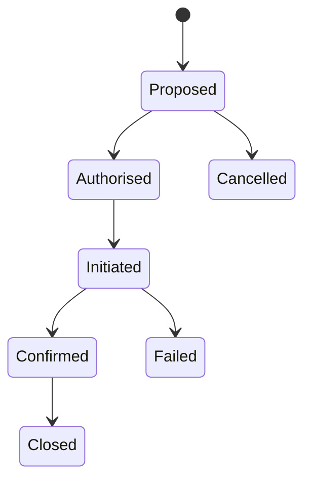

# EOS-S05B Event Continuity Fallback and Incident Command

**Status:** CEO review draft

## Continuity plan

Map each critical service—power, catering, AV, security and any event-specific category—to maximum tolerable interruption, lead time, dependencies, primary assignment, standby candidates, decision authority, communication plan and reserve impact.

## Checkpoints

72h/24h/6h are default templates, not universal law. Each checkpoint has due time, owner, required evidence, status, escalation SLA and idempotent reminder intent. A check-in response is immutable evidence with correction lineage.

## Fallback activation state

The “one-click” experience is a decision workspace, not autonomous execution. One authorised action may create a bounded activation plan and approved internal tasks. It may not contact or book the standby, spend reserve, cancel a primary vendor or make a payment without the relevant separate authority.

## Trigger sources

Manual report, missed checkpoint, verified vendor message, incident, venue instruction or monitored system signal. Every trigger records confidence and evidence. AI may recommend escalation; it cannot set `AUTHORISED`.

## Incident command

Incident records separate observed facts, reported claims, hypotheses, decisions and actions. Include severity, affected functions, people-safety flag, event phase, spatial references, vendor assignments, financial exposure, notifications, evidence custody and timeline.

Immediate life-safety copy must direct staff to established emergency procedures and human emergency services; the platform must not imply it dispatched help.

## Learning loop

Post-incident review proposes updates to vendor indicators, continuity templates and risk rules. Nothing retroactively rewrites the incident or automatically changes a vendor approval.

